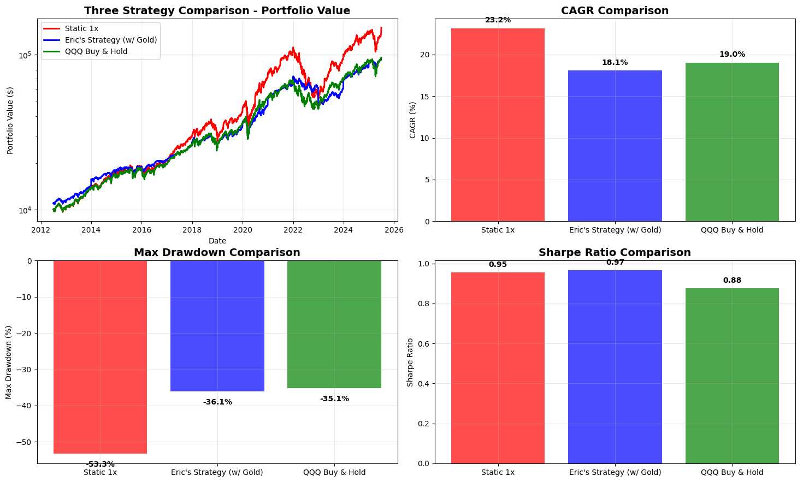
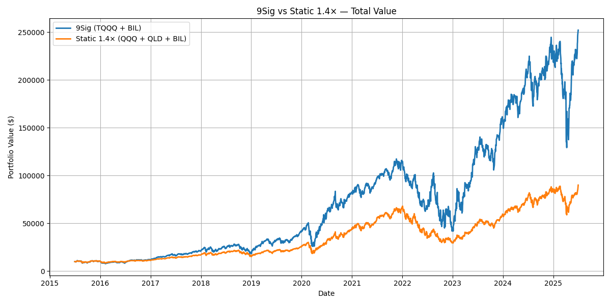

# Quantitative Strategy Backtesting

This framework compares different investment strategies through comprehensive backtesting analysis. Run any script to generate detailed performance comparisons with visualizations.

## 🎯 Investment Strategies Explained

### **9Sig Strategy**
- **Concept**: Dynamic leverage strategy using TQQQ (3x leveraged NASDAQ) + BIL (Treasury Bills)
- **Mechanism**: Quarterly rebalancing targeting 9% growth per quarter
- **Risk Profile**: High volatility, high potential returns
- **Best For**: Aggressive growth investors comfortable with significant drawdowns

### **Eric's Strategy**
- **Concept**: Diversified portfolio with annual rebalancing
- **Allocation**: 20% BIL (cash), 30% QQQ (tech), 40% SCHD (dividends), 10% QLD (2x leverage), 10% BTC/GLD (alternative asset)
- **Risk Profile**: Moderate to high, depends on alternative asset choice
- **Best For**: Investors seeking diversification with growth potential

### **Static 1.4x Strategy**
- **Concept**: Fixed leverage strategy using QQQ + QLD + BIL
- **Mechanism**: Maintains consistent 1.4x leverage through quarterly rebalancing
- **Risk Profile**: Moderate volatility with steady leverage
- **Best For**: Investors wanting controlled leverage exposure

### **QQQ Buy & Hold**
- **Concept**: Simple buy and hold of NASDAQ-100 ETF
- **Mechanism**: No rebalancing, just dividend reinvestment
- **Risk Profile**: Market-level volatility
- **Best For**: Long-term passive investors, baseline comparison

## 📈 Performance Results (August 2025)

### **Available Snapshots:**

#### **`3compare_aug2025.png`** - Conservative Strategy Comparison (2011-2025)
**Winner: Eric's Strategy with Gold** 🥇



- **Eric's Strategy (w/ Gold)**: $112,848 final value, 18.5% CAGR, excellent Sharpe ratio (0.97)
- **QQQ Buy & Hold**: $110,256 final value, 19.2% CAGR, lowest risk (-35.1% max drawdown)
- **Static 1x**: $101,470 final value, 18.4% CAGR

**Key Insight**: Gold provides steady diversification benefits over long periods.

#### **`4compare_aug2025.png`** - Ultimate Strategy Showdown (2015-2025)
**Winner: Eric's Strategy with Bitcoin** 🚀


- **Eric's Strategy (w/ Bitcoin)**: $503,281 final value, 46.6% CAGR (+813% vs QQQ!)
- **9Sig Strategy**: $252,220 final value, 38.1% CAGR (dynamic leverage wins)
- **Static 1.4x**: $78,185 final value, 22.8% CAGR (steady growth)
- **QQQ Buy & Hold**: $55,124 final value, 18.6% CAGR (baseline)

**Key Insight**: Bitcoin exposure during 2015-2025 was a game-changer for portfolio performance.

#### **`9sig_vs_qld433_aug2025.png`** - Leverage Strategy Battle (2015-2025)
**Winner: 9Sig Strategy** ⚡



- **9Sig (TQQQ + BIL)**: $252,220 final value, 38.1% CAGR (dynamic leverage)
- **Static 1.4x (QQQ + QLD + BIL)**: $78,185 final value, 22.8% CAGR (fixed leverage)

**Key Insight**: Dynamic leverage adjustment (9Sig) significantly outperformed static leverage during this bull market period.

#### **`eric_vs_qqq_aug2025.png`** - Diversification vs Simplicity (2015-2025)
**Winner: Eric's Strategy** 💎


- **Eric's Strategy**: $503,281 final value, 46.6% CAGR (diversification + Bitcoin)
- **QQQ Buy & Hold**: $55,124 final value, 18.6% CAGR (simple & reliable)

**Key Insight**: Strategic diversification with alternative assets can dramatically enhance returns, but requires active management.

#### **`eric_gld_vs_qqq_aug2025.png`** - Gold vs Tech Stocks (2015-2025)
**Winner: QQQ Buy & Hold** 📈


- **QQQ Buy & Hold**: $55,124 final value, 18.6% CAGR (tech dominance)
- **Eric's Strategy (w/ Gold)**: $50,593 final value, 16.5% CAGR (conservative approach)

**Key Insight**: During tech boom periods, simple QQQ often beats complex strategies with conservative assets like Gold.

## 🚀 Quick Start

**Run any comparison to see the results:**
```bash
cd quant_study

# Conservative strategies (2011-2025)
python 3compare.py

# All strategies showdown (2015-2025) 
python 4compare.py

# Leverage strategies head-to-head
python 9sig_vs_qld433.py

# Diversification vs simplicity
python eric_vs_qqq.py

# Gold vs tech stocks
python eric_gld_vs_qqq.py
```

Each script generates a detailed chart saved in `backtest_snapshot/` and prints performance statistics to the console.

---

# 🛠 Developer Documentation

## 📁 File Structure

### Core Modules
- **`backtest_utils.py`** - Common utilities for data download, performance calculation, and visualization
- **`strategies.py`** - Standardized strategy implementations 
- **`__init__.py`** - Package initialization with convenient imports

### Strategy Comparison Scripts
- **`3compare.py`** - Three strategy comparison (Static 1x, Eric's Strategy w/ Gold, QQQ Buy & Hold)
- **`4compare.py`** - Four strategy comparison (9Sig, Static 1.4x, Eric's Strategy, QQQ Buy & Hold)
- **`9sig_vs_qld433.py`** - 9Sig vs Static 1.4x comparison
- **`eric_vs_qqq.py`** - Eric's strategy (w/ Bitcoin) vs QQQ comparison
- **`eric_gld_vs_qqq.py`** - Eric's strategy (w/ Gold) vs QQQ comparison

### Utilities & Documentation
- **`prepare_data.py`** - Data preparation utilities (legacy)
- **`backtest_snapshot/`** - Directory for storing backtest result charts and snapshots

## 📊 Available Strategy Functions

### `backtest_9sig_strategy()`
- **Description**: TQQQ + BIL with quarterly 9% growth target
- **Parameters**: `tqqq_weight=0.60`, `quarterly_growth=1.09`
- **Rebalancing**: Quarterly

### `backtest_static_leverage_strategy()`
- **Description**: Static leverage with periodic rebalancing
- **Parameters**: Configurable tickers, weights, and frequency
- **Rebalancing**: Quarterly or Annual

### `backtest_eric_strategy()`
- **Description**: Diversified strategy with annual rebalancing
- **Default Allocation**: 20% BIL, 30% QQQ, 40% SCHD, 10% QLD, 10% BTC/GLD
- **Rebalancing**: Annual

### `backtest_buy_and_hold()`
- **Description**: Simple buy and hold with dividend reinvestment
- **Parameters**: Any single ticker
- **Rebalancing**: None (dividend reinvestment only)

## 🛠 Common Utilities

### Data Management
```python
prices = download_price_data(tickers, start_date, end_date)
dividends = download_dividend_data(tickers)
```

### Performance Analysis
```python
stats = calculate_performance_stats(portfolio_values, risk_free_rate, "Strategy Name")
# Returns: final_value, cagr, max_drawdown, volatility, sharpe_ratio
```

### Visualization
```python
# Comprehensive 4-subplot comparison
create_comparison_plot(strategy_results, "Comparison Title")

# Summary table
print_performance_summary(strategy_results)
```

## 📈 Usage Examples

### Simple Two-Strategy Comparison
```python
from backtest_utils import download_price_data, download_dividend_data, calculate_performance_stats
from strategies import backtest_9sig_strategy, backtest_buy_and_hold

# Download data
prices = download_price_data(["TQQQ", "BIL", "QQQ"], "2015-01-01", "2025-01-01")
dividends = download_dividend_data(["TQQQ", "BIL", "QQQ"])

# Run strategies
val_9sig, _ = backtest_9sig_strategy(prices, dividends, 10000)
val_qqq, _ = backtest_buy_and_hold(prices, dividends, "QQQ", 10000)

# Calculate performance
rf = prices["BIL"].pct_change()
stats_9sig = calculate_performance_stats(val_9sig, rf, "9Sig")
stats_qqq = calculate_performance_stats(val_qqq, rf, "QQQ")
```

### Multi-Strategy Comparison with Visualization
```python
from backtest_utils import create_comparison_plot, print_performance_summary

# Prepare results dictionary
strategy_results = {
    "9Sig": (val_9sig, stats_9sig),
    "QQQ Buy & Hold": (val_qqq, stats_qqq)
}

# Create comprehensive plots
create_comparison_plot(strategy_results, "Strategy Comparison")
print_performance_summary(strategy_results)
```

## 🔧 Configuration Constants

Pre-defined strategy configurations are available:
- `ERIC_STRATEGY_BTC` - Eric's strategy with Bitcoin
- `ERIC_STRATEGY_GOLD` - Eric's strategy with Gold instead of Bitcoin
- `TICKERS_9SIG` - Tickers for 9Sig strategy
- `TICKERS_STATIC_14X` - Tickers for Static 1.4x strategy
